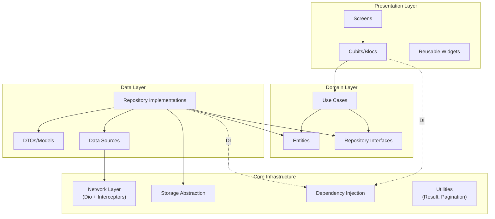

# Flutter Production Starter BLoC

[](https://github.com/yealtun/flutter-production-starter-bloc/actions/workflows/ci.yml)
[](https://opensource.org/licenses/MIT)
[](https://flutter.dev)
[](https://dart.dev)
[](https://github.com/yealtun/flutter-production-starter-bloc)

**English** | [Türkçe](README.tr.md)

---

A production-grade Flutter starter template demonstrating professional engineering practices, Clean Architecture, BLoC/Cubit state management, REST API integration, comprehensive testing, and CI/CD. This repository serves as a portfolio reference showcasing modern Flutter development best practices.

## 📋 Table of Contents

- [Features](#-features)
- [Architecture](#-architecture)
- [Tech Stack](#-tech-stack)
- [Getting Started](#-getting-started)
- [Screenshots](#-screenshots)
- [Documentation](#-documentation)
- [Testing](#-testing)
- [Development](#-development)
- [Contributing](#-contributing)
- [License](#-license)

## ✨ Features

### 🔐 Authentication
- **Login Flow**: Complete authentication flow with form validation
- **Token Management**: Secure token storage and refresh mechanism
- **State Management**: Auth state handled with Cubit following BLoC pattern
- **Route Guards**: Protected routes with authentication checks

### 📰 Feed
- **Pagination**: Efficient paginated list implementation
- **Pull-to-Refresh**: User-friendly refresh mechanism
- **Error Handling**: Comprehensive error states and user feedback
- **Empty States**: Proper handling of empty data scenarios
- **Item Details**: Navigation to detailed item views

### 🔌 SDK Demo
- **Wrapper Pattern**: Demonstrates SDK wrapper pattern for third-party integrations
- **Initialization**: Proper SDK initialization and configuration
- **Event Tracking**: Analytics event tracking implementation

### 🤖 AI Demo
- **API Client**: AI API client with proper error handling
- **Rate Limiting**: 429 error handling with retry-after support
- **Error Recovery**: Graceful handling of rate limit scenarios

### ⚙️ Settings
- **Environment Display**: Shows current app environment
- **Feature Flags**: Toggle features on/off dynamically
- **App Version**: Display app version and build number

## 🏗️ Architecture

This project follows **Clean Architecture** principles with a **feature-first** organization, promoting separation of concerns, testability, and scalability.

### Architecture Diagram



### Feature-First Structure

Features are organized by domain functionality rather than by layer:

```
lib/
├── main.dart                    # Entry point
├── app.dart                     # App widget with routing
└── core/                        # Shared infrastructure
│   ├── config/                  # Environment configuration
│   ├── di/                      # Dependency injection (get_it)
│   ├── network/                 # Dio client + interceptors
│   │   ├── dio_client.dart
│   │   ├── interceptors/
│   │   │   ├── auth_interceptor.dart
│   │   │   ├── logging_interceptor.dart
│   │   │   └── retry_interceptor.dart
│   │   └── error/
│   │       ├── api_exception.dart
│   │       └── error_mapper.dart
│   ├── logging/                 # Logger wrapper
│   ├── storage/                 # Storage abstraction
│   ├── utils/                   # Result<T>, pagination, validators
│   └── analytics/               # Analytics service interface
└── features/                    # Feature modules
    ├── auth/                    # Authentication feature
    │   ├── data/
    │   │   ├── datasources/
    │   │   ├── models/
    │   │   └── repositories/
    │   ├── domain/
    │   │   ├── entities/
    │   │   ├── repositories/
    │   │   └── usecases/
    │   └── presentation/
    │       ├── cubit/
    │       └── screens/
    ├── feed/                    # Feed feature
    ├── sdk_demo/                # SDK wrapper pattern demo
    └── ai_demo/                 # AI client demo
```

### Dependency Flow

```
Presentation → Domain ← Data
     ↓            ↑
   Core Infrastructure
```

- **Presentation** depends on **Domain**
- **Data** depends on **Domain**
- **Domain** has no dependencies (pure Dart)
- **Core** provides shared infrastructure

### Key Architectural Decisions

1. **Feature-First Organization**: Related code is co-located, making features easier to understand and maintain
2. **Clean Architecture**: Clear separation between business logic and implementation details
3. **Dependency Injection**: Centralized DI using `get_it` for testability
4. **Result Pattern**: Type-safe error handling with `Result<T>` instead of exceptions
5. **Repository Pattern**: Abstraction layer between data sources and business logic

## 🛠️ Tech Stack

| Category | Technology | Version |
|----------|-----------|---------|
| **Framework** | Flutter | 3.38.6 (via FVM) |
| **Language** | Dart | 3.10.7+ |
| **State Management** | flutter_bloc | ^8.1.6 (Cubit-focused) |
| **Dependency Injection** | get_it | ^8.0.2 |
| **Networking** | dio | ^5.7.0 |
| **Serialization** | freezed + json_serializable | ^2.4.4 / ^4.9.0 |
| **Routing** | go_router | ^14.6.2 |
| **Logging** | logger | Latest |
| **Storage** | shared_preferences | Latest |
| **Testing** | flutter_test + mocktail + bloc_test | Latest |

## 🚀 Getting Started

### Prerequisites

- **Flutter SDK**: Managed via FVM (Flutter Version Management)
- **FVM**: Install from [fvm.app](https://fvm.app)
- **Dart SDK**: 3.10.7+ (included with Flutter)

### Installation

1. **Install FVM** (if not already installed):
   ```bash
   dart pub global activate fvm
   ```

2. **Install Flutter via FVM**:
   ```bash
   fvm install 3.38.6
   fvm use 3.38.6
   ```

3. **Install dependencies**:
   ```bash
   fvm flutter pub get
   ```

4. **Generate code** (for freezed and json_serializable):
   ```bash
   fvm flutter pub run build_runner build --delete-conflicting-outputs
   ```

### Running the App

#### Development Mode

```bash
fvm flutter run \
  --dart-define=APP_ENV=dev \
  --dart-define=API_BASE_URL=https://jsonplaceholder.typicode.com
```

#### Production Mode

```bash
fvm flutter run \
  --dart-define=APP_ENV=prod \
  --dart-define=API_BASE_URL=https://api.example.com
```

### Environment Variables

The app uses `--dart-define` for configuration:

| Variable | Description | Example |
|----------|-------------|---------|
| `APP_ENV` | Environment (dev, stage, prod) | `dev` |
| `API_BASE_URL` | Base URL for the main API | `https://api.example.com` |
| `AI_BASE_URL` | Base URL for AI API (optional) | `https://ai.example.com` |

**Note**: Never commit API keys or secrets. Use `--dart-define` or environment-specific configuration files (excluded from git).

## 📸 Screenshots

> **Note**: Screenshots will be added soon. To add screenshots:
> 1. Run the app and capture screenshots of key features
> 2. Save them in a `screenshots/` directory
> 3. Update this section with image references

<!--
### Login Screen


### Feed Screen


### Settings Screen

-->

## 📚 Documentation

Comprehensive documentation is available in the `docs/` directory:

| Document | Description |
|----------|-------------|
| [Architecture](docs/01_architecture.md) | Clean Architecture explanation and structure |
| [API Client](docs/02_api_client.md) | Dio client setup and interceptors |
| [BLoC/Cubit](docs/03_bloc_cubit.md) | State management patterns and best practices |
| [Testing](docs/04_testing.md) | Testing strategy, examples, and coverage |
| [Observability](docs/05_observability.md) | Logging, analytics, and monitoring |
| [Performance](docs/06_performance.md) | Performance optimizations and best practices |
| [Release Checklist](docs/07_release_checklist.md) | Release process and versioning |
| [Security](docs/08_security_secrets.md) | Security practices and secrets management |
| [Optional Integrations](docs/09_optional_integrations.md) | Firebase, Paywall, MMP integrations |

## 🧪 Testing

### Run All Tests

```bash
fvm flutter test
```

### Run Specific Test Files

```bash
# Unit tests
fvm flutter test test/core/

# Feature tests
fvm flutter test test/features/

# Integration tests
fvm flutter test integration_test/
```

### Test Coverage

```bash
# Generate coverage report
fvm flutter test --coverage

# View coverage (requires lcov)
genhtml coverage/lcov.info -o coverage/html
```

### Code Generation

After modifying freezed models or json_serializable classes:

```bash
# One-time generation
fvm flutter pub run build_runner build --delete-conflicting-outputs

# Watch mode (auto-regenerate on file changes)
fvm flutter pub run build_runner watch --delete-conflicting-outputs
```

## 🔧 Development

### Code Quality

- **Linting**: Custom rules in `analysis_options.yaml`
- **Formatting**: Automated with `dart format`
- **Static Analysis**: Run `fvm flutter analyze`
- **CI Checks**: All quality gates run automatically on PR

### Git Workflow

This project follows professional Git practices:

- **Conventional Commits**: All commits follow [Conventional Commits](https://www.conventionalcommits.org/) specification
- **Branch Protection**: Main branch is protected
- **PR Reviews**: All changes require review before merge
- **Commit Messages**: Include emojis and clear descriptions

Example commit message:
```
feat: add pagination to feed screen

- Implement infinite scroll
- Add loading indicators
- Handle empty states
```

### Project Structure

- **Feature-First**: Features are self-contained modules
- **Clean Architecture**: Clear separation of concerns
- **Testability**: All layers are easily testable
- **Scalability**: Easy to add new features

## 🤝 Contributing

Contributions are welcome! Please follow these guidelines:

### Getting Started

1. Fork the repository
2. Create a feature branch (`git checkout -b feature/amazing-feature`)
3. Make your changes
4. Run tests and ensure they pass (`fvm flutter test`)
5. Run code analysis (`fvm flutter analyze`)
6. Commit your changes (following Conventional Commits)
7. Push to your branch (`git push origin feature/amazing-feature`)
8. Open a Pull Request

### Code Style

- Follow Dart/Flutter style guide
- Use `dart format` before committing
- Write meaningful commit messages
- Add tests for new features
- Update documentation as needed

### Pull Request Process

1. Ensure all tests pass
2. Update documentation if needed
3. Add screenshots for UI changes
4. Request review from maintainers

## 📝 License

This project is licensed under the MIT License - see the [LICENSE](LICENSE) file for details.

---

**Built with ❤️ using Flutter**
