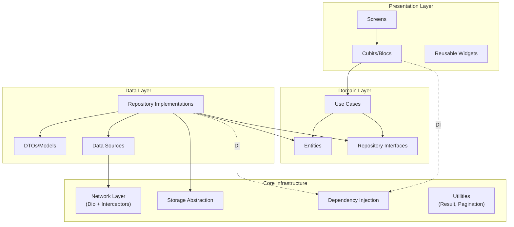

# Flutter Production Starter BLoC

[](https://github.com/yealtun/flutter-production-starter-bloc/actions/workflows/ci.yml)
[](https://opensource.org/licenses/MIT)
[](https://flutter.dev)
[](https://dart.dev)
[](https://github.com/yealtun/flutter-production-starter-bloc)

[English](README.md) | **Türkçe**

---

Production seviyesinde Flutter başlangıç şablonu. Profesyonel mühendislik uygulamaları, Clean Architecture, BLoC/Cubit state management, REST API entegrasyonu, kapsamlı testler ve CI/CD gösterimi. Bu repository, modern Flutter geliştirme best practice'lerini sergileyen bir portfolio referansı olarak hizmet eder.

## 📋 İçindekiler

- [Özellikler](#-özellikler)
- [Mimari](#-mimari)
- [Teknoloji Yığını](#-teknoloji-yığını)
- [Başlangıç](#-başlangıç)
- [Ekran Görüntüleri](#-ekran-görüntüleri)
- [Dokümantasyon](#-dokümantasyon)
- [Testler](#-testler)
- [Geliştirme](#-geliştirme)
- [Katkıda Bulunma](#-katkıda-bulunma)
- [Lisans](#-lisans)

## ✨ Özellikler

### 🔐 Kimlik Doğrulama
- **Giriş Akışı**: Form doğrulama ile tam kimlik doğrulama akışı
- **Token Yönetimi**: Güvenli token saklama ve yenileme mekanizması
- **State Management**: BLoC pattern'ini takip eden Cubit ile auth state yönetimi
- **Route Guards**: Kimlik doğrulama kontrolleri ile korumalı rotalar

### 📰 Feed
- **Sayfalama**: Verimli sayfalanmış liste implementasyonu
- **Pull-to-Refresh**: Kullanıcı dostu yenileme mekanizması
- **Hata Yönetimi**: Kapsamlı hata durumları ve kullanıcı geri bildirimi
- **Boş Durumlar**: Boş veri senaryolarının uygun şekilde ele alınması
- **Öğe Detayları**: Detaylı öğe görünümlerine navigasyon

### 🔌 SDK Demo
- **Wrapper Pattern**: Üçüncü taraf entegrasyonlar için SDK wrapper pattern gösterimi
- **Başlatma**: Uygun SDK başlatma ve yapılandırma
- **Event Tracking**: Analytics event tracking implementasyonu

### 🤖 AI Demo
- **API Client**: Uygun hata yönetimi ile AI API client'ı
- **Rate Limiting**: Retry-after desteği ile 429 hata yönetimi
- **Hata Kurtarma**: Rate limit senaryolarının zarif şekilde ele alınması

### ⚙️ Ayarlar
- **Ortam Gösterimi**: Mevcut uygulama ortamını gösterir
- **Feature Flags**: Özellikleri dinamik olarak açıp kapatma
- **Uygulama Versiyonu**: Uygulama versiyonu ve build numarasını gösterir

## 🏗️ Mimari

Bu proje, endişelerin ayrılmasını, test edilebilirliği ve ölçeklenebilirliği teşvik eden **feature-first** organizasyon ile **Clean Architecture** prensiplerini takip eder.

### Mimari Diyagram



### Feature-First Yapı

Özellikler katman yerine domain işlevselliğine göre organize edilir:

```
lib/
├── main.dart                    # Giriş noktası
├── app.dart                     # Routing ile App widget'ı
└── core/                        # Paylaşılan altyapı
│   ├── config/                  # Ortam yapılandırması
│   ├── di/                      # Dependency injection (get_it)
│   ├── network/                 # Dio client + interceptors
│   │   ├── dio_client.dart
│   │   ├── interceptors/
│   │   │   ├── auth_interceptor.dart
│   │   │   ├── logging_interceptor.dart
│   │   │   └── retry_interceptor.dart
│   │   └── error/
│   │       ├── api_exception.dart
│   │       └── error_mapper.dart
│   ├── logging/                 # Logger wrapper
│   ├── storage/                 # Storage abstraction
│   ├── utils/                   # Result<T>, pagination, validators
│   └── analytics/               # Analytics service interface
└── features/                    # Feature modülleri
    ├── auth/                    # Kimlik doğrulama özelliği
    │   ├── data/
    │   │   ├── datasources/
    │   │   ├── models/
    │   │   └── repositories/
    │   ├── domain/
    │   │   ├── entities/
    │   │   ├── repositories/
    │   │   └── usecases/
    │   └── presentation/
    │       ├── cubit/
    │       └── screens/
    ├── feed/                    # Feed özelliği
    ├── sdk_demo/                # SDK wrapper pattern demo
    └── ai_demo/                 # AI client demo
```

### Bağımlılık Akışı

```
Presentation → Domain ← Data
     ↓            ↑
   Core Infrastructure
```

- **Presentation** **Domain**'e bağımlıdır
- **Data** **Domain**'e bağımlıdır
- **Domain**'in bağımlılığı yoktur (saf Dart)
- **Core** paylaşılan altyapıyı sağlar

### Önemli Mimari Kararlar

1. **Feature-First Organizasyon**: İlgili kodlar birlikte konumlandırılır, özelliklerin anlaşılması ve bakımı kolaylaşır
2. **Clean Architecture**: İş mantığı ve implementasyon detayları arasında net ayrım
3. **Dependency Injection**: Test edilebilirlik için `get_it` kullanarak merkezi DI
4. **Result Pattern**: Exception'lar yerine `Result<T>` ile type-safe hata yönetimi
5. **Repository Pattern**: Veri kaynakları ve iş mantığı arasında abstraction katmanı

## 🛠️ Teknoloji Yığını

| Kategori | Teknoloji | Versiyon |
|----------|-----------|----------|
| **Framework** | Flutter | 3.38.6 (FVM ile) |
| **Dil** | Dart | 3.10.7+ |
| **State Management** | flutter_bloc | ^8.1.6 (Cubit odaklı) |
| **Dependency Injection** | get_it | ^8.0.2 |
| **Networking** | dio | ^5.7.0 |
| **Serialization** | freezed + json_serializable | ^2.4.4 / ^4.9.0 |
| **Routing** | go_router | ^14.6.2 |
| **Logging** | logger | Latest |
| **Storage** | shared_preferences | Latest |
| **Testing** | flutter_test + mocktail + bloc_test | Latest |

## 🚀 Başlangıç

### Gereksinimler

- **Flutter SDK**: FVM (Flutter Version Management) ile yönetilir
- **FVM**: [fvm.app](https://fvm.app) adresinden kurulum
- **Dart SDK**: 3.10.7+ (Flutter ile birlikte gelir)

### Kurulum

1. **FVM Kurulumu** (eğer yüklü değilse):
   ```bash
   dart pub global activate fvm
   ```

2. **FVM ile Flutter Kurulumu**:
   ```bash
   fvm install 3.38.6
   fvm use 3.38.6
   ```

3. **Bağımlılıkları Yükle**:
   ```bash
   fvm flutter pub get
   ```

4. **Kod Üretimi** (freezed ve json_serializable için):
   ```bash
   fvm flutter pub run build_runner build --delete-conflicting-outputs
   ```

### Uygulamayı Çalıştırma

#### Development Modu

```bash
fvm flutter run \
  --dart-define=APP_ENV=dev \
  --dart-define=API_BASE_URL=https://jsonplaceholder.typicode.com
```

#### Production Modu

```bash
fvm flutter run \
  --dart-define=APP_ENV=prod \
  --dart-define=API_BASE_URL=https://api.example.com
```

### Ortam Değişkenleri

Uygulama yapılandırma için `--dart-define` kullanır:

| Değişken | Açıklama | Örnek |
|----------|----------|-------|
| `APP_ENV` | Ortam (dev, stage, prod) | `dev` |
| `API_BASE_URL` | Ana API için base URL | `https://api.example.com` |
| `AI_BASE_URL` | AI API için base URL (opsiyonel) | `https://ai.example.com` |

**Not**: API key'leri veya secret'ları asla commit etmeyin. `--dart-define` veya ortam-spesifik yapılandırma dosyaları kullanın (git'ten hariç tutulmuş).

## 📸 Ekran Görüntüleri

> **Not**: Ekran görüntüleri yakında eklenecek. Ekran görüntüsü eklemek için:
> 1. Uygulamayı çalıştırın ve önemli özelliklerin ekran görüntülerini alın
> 2. Bunları `screenshots/` dizinine kaydedin
> 3. Bu bölümü görsel referanslarla güncelleyin

<!--
### Giriş Ekranı


### Feed Ekranı


### Ayarlar Ekranı

-->

## 📚 Dokümantasyon

Kapsamlı dokümantasyon `docs/` dizininde mevcuttur:

| Doküman | Açıklama |
|---------|----------|
| [Mimari](docs/01_architecture.md) | Clean Architecture açıklaması ve yapısı |
| [API Client](docs/02_api_client.md) | Dio client kurulumu ve interceptors |
| [BLoC/Cubit](docs/03_bloc_cubit.md) | State management pattern'leri ve best practice'ler |
| [Testler](docs/04_testing.md) | Test stratejisi, örnekler ve coverage |
| [Observability](docs/05_observability.md) | Logging, analytics ve monitoring |
| [Performans](docs/06_performance.md) | Performans optimizasyonları ve best practice'ler |
| [Release Checklist](docs/07_release_checklist.md) | Release süreci ve versiyonlama |
| [Güvenlik](docs/08_security_secrets.md) | Güvenlik uygulamaları ve secret yönetimi |
| [Opsiyonel Entegrasyonlar](docs/09_optional_integrations.md) | Firebase, Paywall, MMP entegrasyonları |

## 🧪 Testler

### Tüm Testleri Çalıştır

```bash
fvm flutter test
```

### Belirli Test Dosyalarını Çalıştır

```bash
# Unit testler
fvm flutter test test/core/

# Feature testler
fvm flutter test test/features/

# Integration testler
fvm flutter test integration_test/
```

### Test Coverage

```bash
# Coverage raporu oluştur
fvm flutter test --coverage

# Coverage görüntüle (lcov gerektirir)
genhtml coverage/lcov.info -o coverage/html
```

### Kod Üretimi

Freezed modelleri veya json_serializable sınıflarını değiştirdikten sonra:

```bash
# Tek seferlik üretim
fvm flutter pub run build_runner build --delete-conflicting-outputs

# Watch modu (dosya değişikliklerinde otomatik yeniden üretim)
fvm flutter pub run build_runner watch --delete-conflicting-outputs
```

## 🔧 Geliştirme

### Kod Kalitesi

- **Linting**: `analysis_options.yaml` içinde özel kurallar
- **Formatting**: `dart format` ile otomatik
- **Static Analysis**: `fvm flutter analyze` çalıştırın
- **CI Kontrolleri**: Tüm kalite kontrolleri PR'da otomatik çalışır

### Git Workflow

Bu proje profesyonel Git uygulamalarını takip eder:

- **Conventional Commits**: Tüm commit'ler [Conventional Commits](https://www.conventionalcommits.org/) spesifikasyonunu takip eder
- **Branch Protection**: Main branch korumalıdır
- **PR Reviews**: Tüm değişiklikler merge edilmeden önce review gerektirir
- **Commit Mesajları**: Emoji ve net açıklamalar içerir

Örnek commit mesajı:
```
feat: feed ekranına sayfalama ekle

- Infinite scroll implementasyonu
- Loading göstergeleri ekle
- Boş durumları ele al
```

### Proje Yapısı

- **Feature-First**: Özellikler kendi kendine yeten modüllerdir
- **Clean Architecture**: Net endişe ayrımı
- **Test Edilebilirlik**: Tüm katmanlar kolayca test edilebilir
- **Ölçeklenebilirlik**: Yeni özellikler eklemek kolaydır

## 🤝 Katkıda Bulunma

Katkılarınızı bekliyoruz! Lütfen şu kurallara uyun:

### Başlangıç

1. Repository'yi fork edin
2. Feature branch oluşturun (`git checkout -b feature/amazing-feature`)
3. Değişikliklerinizi yapın
4. Testleri çalıştırın ve geçtiğinden emin olun (`fvm flutter test`)
5. Kod analizi çalıştırın (`fvm flutter analyze`)
6. Değişikliklerinizi commit edin (Conventional Commits'i takip ederek)
7. Branch'inize push edin (`git push origin feature/amazing-feature`)
8. Pull Request açın

### Kod Stili

- Dart/Flutter style guide'ı takip edin
- Commit etmeden önce `dart format` kullanın
- Anlamlı commit mesajları yazın
- Yeni özellikler için test ekleyin
- Gerektiğinde dokümantasyonu güncelleyin

### Pull Request Süreci

1. Tüm testlerin geçtiğinden emin olun
2. Gerektiğinde dokümantasyonu güncelleyin
3. UI değişiklikleri için ekran görüntüleri ekleyin
4. Maintainer'lardan review isteyin

## 📝 Lisans

Bu proje MIT Lisansı altında lisanslanmıştır - detaylar için [LICENSE](LICENSE) dosyasına bakın.

---

**Flutter ile ❤️ ile yapıldı**
